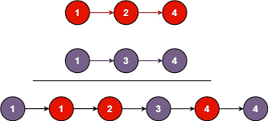

<h2>You're given the heads of 2 sorted linked lists</h2>
<h2>list1 & list2</h2>
 
<h2>Merge 2 lists in a one Sorted list</h2>
<h2>The list should be made by splicing together</h2>
<h2>the nodes of first 2 lists</h2>
 
<h2>Ex1</h2>
<h2>Input: </h2>
<h2>list1 = [1,2,4]</h2>
<h2>list2 = [1,3,4]</h2>
<h2>Output: [1,1,2,3,4,4]</h2>
 
<h2>Ex2</h2>
<h2>Input: </h2>
<h2>list1 = []</h2>
<h2>list2 = []</h2>
<h2>Output: []</h2>
 
<h2>Ex3</h2>
<h2>Input: </h2>
<h2>list1 = []</h2>
<h2>list2 = [0]</h2>
<h2>Output: [0]</h2>
 
<h2>Constraints: </h2>
<h2># of nodes in both lists is in range [0, 50]</h2>
<h2>-100 <= Node.val <= 100</h2>
<h2>Both list1 & list2 are sorted in non-decreasing order</h2>
 
<h2>1 -> 2 -> 4</h2>
<h2>1 -> 3 -> 4</h2>