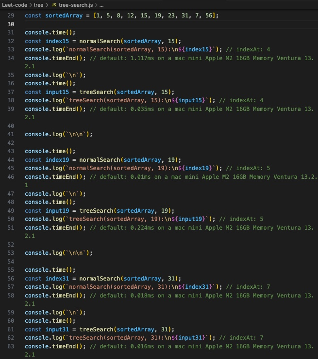

<h2>This is a demo for using Tree algorithm for binary Index searching</h2>
 
<h2>1. Creating an arrow function using Tree</h2>

 
<h2>2. Creating 2nd arrow function using .findIndex() method</h2>

 
<h2>3. Creating an array => Start console.time() & console.timeEnd() to measure to differences</h2>

 
<h2>4. Using Code Running vscode extension to reflect results</h2>
