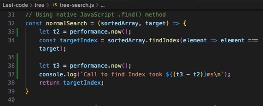

<h2>This is a demo for using Tree algorithm for binary Index searching</h2>
 

<h2>Brief explaination</h2>
<h2>Tree data structure is only good for sorting data inside a large array[] or list[{}] in JavaScript</h2>
<h2>If your existing array has less than 1000 elements</h2>
<h2>forEach loop (mutable) / .map() (immutable) / hashMap array[index] should theoretically do a better job</h2> 
 
<h2>A Tree data structure allows data to be split by half, calculating either Left or Right side of a Tree is the shortest path for iterating through an array[]</h2>

 
<h2>1. Creating an arrow function using Tree</h2>

 
<h2>2. Creating 2nd arrow function using .findIndex() method</h2>

 
<h2>3. Creating an array => Invoke treeSearch vs findIndex methods</h2>

 
<h2>4. Using Code Running vscode extension to reflect results</h2>
